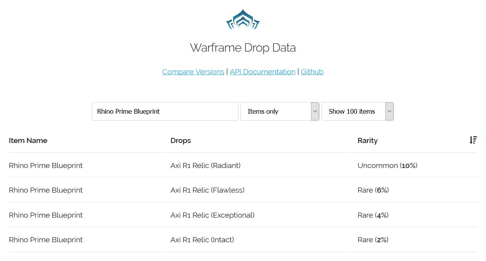

# warframe-drop-data

[](https://github.com/WFCD "Supported by Warframe Community Developers")

Warframe drop data in an easier to parse format.

**NOTE**: This data is parsed from [Digital Extremes official drop data website](https://n8k6e2y6.ssl.hwcdn.net/repos/hnfvc0o3jnfvc873njb03enrf56.html), no data mining was involved.

## Web UI & URL



There is an experimental searchable web ui available at http://drops.warframestat.us

## "API Endpoints"

You can access the data via normal HTTP requests, which makes it usable like an API without really being one.

### /data/all.json

All data from the website in one single file.

Data structure:
```json
{
  "blueprintLocations": [ { ... } ],
  "cetusBountyRewards": [ { ... } ],
  "enemyBlueprintTables": [ { ... } ],
  "enemyModTables": [ { ... } ],
  "keyRewards": [ { ... } ],
  "miscItems": [ { ... } ],
  "missionRewards": { "Earth": { ... } },
  "modLocations": [ { ... } ],
  "relics": [ { ... } ],
  "sortieRewards": [ { ... } ],
  "transientRewards": [ { ... } ]
}
```

### /data/info.json

The metadata of the current build. Updates when Digital Extremes' website is updated.

Data structure:
```json
{
  "hash": "31f5a49b9000520bc3298327128afb98",
  "timestamp": 1524411458909
}
```

### /data/missionRewards.json

All mission rewards, like what drops where and in which rotation. [(Source)](https://n8k6e2y6.ssl.hwcdn.net/repos/hnfvc0o3jnfvc873njb03enrf56.html#missionRewards)

Data structure:
```json
"missionRewards": {
  "Sedna": {
    "Hydron": {
      "gameMode": "Defense",
      "isEvent": false,
      "rewards": {
        "A": [
          {
            "_id": "c0400ac7082c2f3d811e47ca9b7a8ae8",
            "itemName": "Vitality",
            "chance": 11.11,
            "rarity": "Uncommon"
          },
          { ... }
        ],
        "B": [ ... ]
      }
    },
    "Bere": { ... }
  },
  "Earth": { ... }
}
```

### /data/missionRewards/$PLANET_NAME/$PLACE.json

Drop data for a specific location. Example: ```/data/missionRewards/Eris/Xini.json```.

Data structure:
```json
"Hydron": {
  "gameMode": "Defense",
  "isEvent": false,
  "rewards": {
    "A": [
      {
        "_id": "c0400ac7082c2f3d811e47ca9b7a8ae8",
        "itemName": "Vitality",
        "chance": 11.11,
        "rarity": "Uncommon"
      },
      { ... }
    ],
    "B": [ ... ]
  }
}
```

### /data/relics.json

All relics, what they contain, rarity etc. [(Source)](https://n8k6e2y6.ssl.hwcdn.net/repos/hnfvc0o3jnfvc873njb03enrf56.html#relicRewards)

Data structure:
```json
"relics": [
  {
    "_id": "4e4d817f8c2d887316c6d8add253403e",
    "tier": "Axi",
    "relicName": "A1",
    "state": "Intact",
    "rewards": [
      {
        "_id": "6733cc5298452209aa29dd72027c7df1",
        "itemName": "Akstiletto Prime Barrel",
        "chance": 11,
        "rarity": "Uncommon"
      },
      { ... }
    ]
  },
  { ... }
]
```

### /data/relics/$TIER/$RELIC_NAME.json

Data for a specific relic. Example: ```/data/relics/Axi/R1.json```.

Data structure:
```json
{
  "_id": "4e4d817f8c2d887316c6d8add253403e",
  "tier": "Axi",
  "relicName": "A1",
  "state": "Intact",
  "rewards": {
    "Intact": [
      {
        "_id": "6733cc5298452209aa29dd72027c7df1",
        "itemName": "Akstiletto Prime Barrel",
        "chance": 11,
        "rarity": "Uncommon"
      },
      { ... }
    ],
    "Exceptional": [ ... ]
  }
}
```

### /data/transientRewards.json

Rewards not tied to a specific location, like mods dropped by Nightmare Mode missions. [(Source)](https://n8k6e2y6.ssl.hwcdn.net/repos/hnfvc0o3jnfvc873njb03enrf56.html#transientRewards)

Data structure:
```json
"transientRewards": [
  {
    "objectiveName": "Derelict Vault",
    "rewards": [
      {
        "_id": "24a4a903a7846a300d6b04e914e52e1b",
        "itemName": "Anemic Agility",
        "chance": 4.17,
        "rarity": "Rare"
      },
      { ... }
    ]
  },
  { ... }
]
```

### /data/sortieRewards.json

Sortie rewards. [(Source)](https://n8k6e2y6.ssl.hwcdn.net/repos/hnfvc0o3jnfvc873njb03enrf56.html#sortieRewards)

Data structure:
```json
"sortieRewards": [
  {
    "_id": "b3c734177040ffb494609a27d87d4841",
    "itemName": "4000 Endo",
    "chance": 12.1,
    "rarity": "Uncommon"
  },
  { ... }
]
```

### /data/modLocations.json

Mod drops sorted by mod. [(Source)](https://n8k6e2y6.ssl.hwcdn.net/repos/hnfvc0o3jnfvc873njb03enrf56.html#modLocations)

Data structure:
```json
"modLocations": [
  {
    "_id": "b3c734177040ffb494609a27d87d4841",
    "modName": "Accelerated Deflection",
    "enemies": [
      {
        "_id": "68cfde6d20b38ba62b412b48c440a7a0",
        "enemyName": "Arcane Boiler",
        "enemyModDropChance": 3,
        "chance": 7.37,
        "rarity": "Rare"
      },
      { ... }
    ]
  },
  { ... }
]
```

### /data/enemyModTables.json

Mod drops sorted by enemy. [(Source)](https://n8k6e2y6.ssl.hwcdn.net/repos/hnfvc0o3jnfvc873njb03enrf56.html#enemyModTables)

Data structure:
```json
"modLocations": [
  {
    "_id": "2757006e018c952e40a6e3cf74048420",
    "enemyName": "002-Er",
    "enemyModDropChance": "10.00",
    "mods": [
      {
        "_id": "74ab77f66f97e146b6cef713a370e105",
        "modName": "Flux Overdrive",
        "chance": 12.5,
        "rarity": "Uncommon"
      },
      { ... }
    ]
  },
  { ... }
]
```

### /data/enemyBlueprintTables.json

Blueprints and part drops sorted by enemy. [(Source)](https://n8k6e2y6.ssl.hwcdn.net/repos/hnfvc0o3jnfvc873njb03enrf56.html#enemyBlueprintTables)

Data structure:
```json
"enemyBlueprintTables": [
  {
    "_id": "6ba71181fe67be210250c59fdf06ecb8",
    "enemyName": "Arid Heavy Gunner",
    "enemyItemDropChance": "1.00",
    "items": [
      {
        "_id": "9568cc883b465bc94c14e0d206506b2d",
        "itemName": "Gorgon Blueprint",
        "chance": 100,
        "rarity": "Common"
      },
      { ... }
    ]
  },
  { ... }
]
```

### /data/blueprintLocations.json

Blueprints and part drops sorted by item. [(Source)](https://n8k6e2y6.ssl.hwcdn.net/repos/hnfvc0o3jnfvc873njb03enrf56.html#blueprintLocations)

Data structure:
```json
"blueprintLocations": [
  {
    "_id": "2d200b684ad2bac2184a5edc3a9655cb",
    "itemName": "Ash Chassis Blueprint",
    "enemies": [
      {
        "_id": "02ca12683663224f017f209954cb876a",
        "enemyName": "Grineer Manic",
        "enemyItemDropChance": 33,
        "chance": 38.72,
        "rarity": "Common"
      },
      { ... }
    ]
  },
  { ... }
]
```

### /data/cetusBountyRewards.json

Drop data for Cetus bounty missions. [(Source)](https://n8k6e2y6.ssl.hwcdn.net/repos/hnfvc0o3jnfvc873njb03enrf56.html#cetusRewards)

Data structure:
```json
"cetusBountyRewards": [
  {
    "_id": "0b9c958b277561c57f47390f5db201ef",
    "bountyLevel": "Level 10 - 30 Bounty",
    "rewards": {
      "A": [
        {
          "_id": "2d220168d8505314316354e586fe4c7e",
          "stage": "Stage 1",
          "itemName": "100 Endo",
          "chance": 25,
          "rarity": "Uncommon"
        },
        { ... }
      ],
      "B": [ ... ]
    }
  },
  { ... }
]
```

### /data/miscItems.json

Miscellanous enemy item drops. [(Source)](https://n8k6e2y6.ssl.hwcdn.net/repos/hnfvc0o3jnfvc873njb03enrf56.html#miscItems)

Data structure:
```json
"miscItems": [
  {
    "_id": "abce816f002a752c88308d5f6658427c",
    "enemyName": "Akkalak Turret",
    "enemyItemDropChance": "70.00",
    "items": [
      {
        "_id": "a3ab4147ff1f344ae81bc8fd301a4ba5",
        "itemName": "Circuits",
        "chance": 68.02,
        "rarity": "Common"
      },
      { ... }
    ]
  },
  { ... }
]
```

### /data/builds/builds.json

A list of available builds and their timestamps.

Data structure:
```json
[
  {
    "hash": "31f5a49b9000520bc3298327128afb98",
    "timestamp": 1524411458909
  },
  { ... }
]
```

### /data/builds/`{hash}`.json

The `all.json` file of the given hash. Other files, such as `missionRewards.json` are not available for previous builds.

Data structure:
```json
{
  "blueprintLocations": [ { ... } ],
  "cetusBountyRewards": [ { ... } ],
  "enemyBlueprintTables": [ { ... } ],
  "enemyModTables": [ { ... } ],
  "keyRewards": [ { ... } ],
  "miscItems": [ { ... } ],
  "missionRewards": { "Earth": { ... } },
  "modLocations": [ { ... } ],
  "relics": [ { ... } ],
  "sortieRewards": [ { ... } ],
  "transientRewards": [ { ... } ]
}
```

## Disclaimer

This list represents data and drops from the PC version of the Free-to-play game Warframe.
That's right - Warframe is free! Which means our drop system is designed to maintain a balance. Our free players can earn the game's content, and our paying players who support us (and keep the game running) usually get first dibs on the content by using Platinum (which can be traded to free players)!
As far as we can tell... we are the first developers to openly post something quite like this. Let's hope it works out for us and we set a trend.

This is automatically generated from our internal data but this data comes with no guarantees -- do not expect it to be comprehensive for how complex the game is.
This list will be maintained by an automated process which will be published with Updates (not all Hotfixes). We update often and new game systems may or may not be covered here.
This list can be discussed here. Know a free-to-play game that provides official drop rates in a different way? We'd love to know.

## License

MIT
